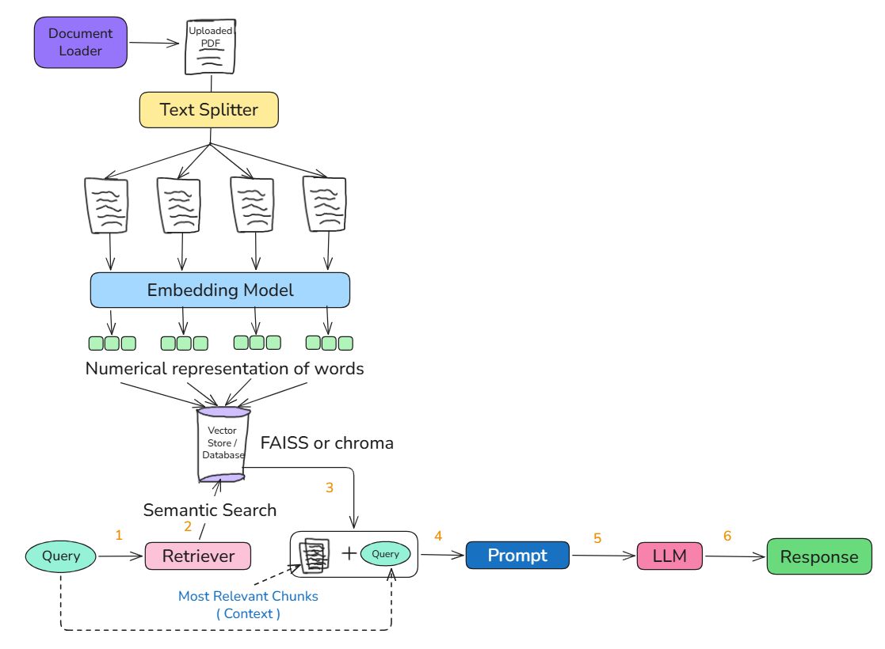
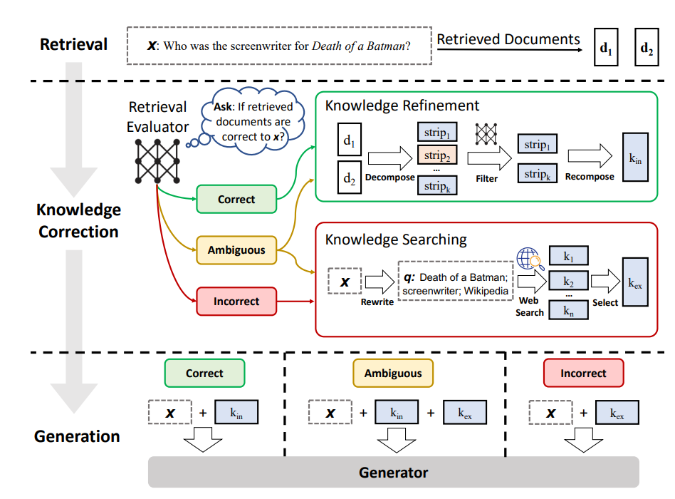
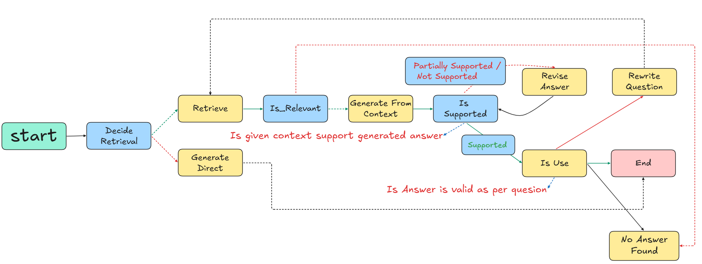

## What is RAG?

**RAG = Retrieval + Generation**

It is a technique where an LLM retrieves relevant information from an external knowledge base before generating a response.

---

## How RAG Works

1. User submits a query.
2. Convert the query into an embedding.
3. Search the vector database for similar document chunks.
4. Retrieve the most relevant chunks.
5. Pass the retrieved context along with the query to the LLM.
6. LLM generates the final response.

---

## RAG Architecture



---

## What is C-RAG? (Corrective Retrieval-Augmented Generation)


# C-RAG (Corrective Retrieval-Augmented Generation)

C-RAG extends traditional RAG by **evaluating the quality of retrieved documents** before generating a response. Instead of blindly trusting the retrieved context, C-RAG decides whether to:

- Use the retrieved documents.
- Perform web search for additional knowledge.
- Combine both retrieved and web knowledge.

Finally, all selected knowledge is **refined** before being passed to the LLM.

---

# Overall C-RAG Architecture

```text
                           User Query (Q)
                                 │
                                 ▼
                      Query Embedding
                                 │
                                 ▼
                         Vector Database
                                 │
                                 ▼
                    Retrieve Top-k Documents
                                 │
                                 ▼
                  Retrieval Evaluator (T5-Large)
                                 │
          ┌──────────────────────┼──────────────────────┐
          │                      │                      │
          ▼                      ▼                      ▼
      Correct               Ambiguous              Incorrect
          │                      │                      │
          │                      │                      │
          │                Rewrite Query         Rewrite Query
          │              (Dedicated LLM)       (Dedicated LLM)
          │                      │                      │
          │                      ▼                      ▼
          │                Web Search             Web Search
          │                      │                      │
          │                      ▼                      ▼
          │          Retrieved Docs + Web Docs     Web Docs
          │                      │                      │
          └──────────────────────┴──────────────────────┘
                                 │
                                 ▼
        +----------------------------------------------------+
        |              Knowledge Refinement                  |
        |----------------------------------------------------|
        | 1. Decompose retrieved documents into              |
        |    knowledge strips (sentence-level)               |
        |                       │                            |
        |                       ▼                            |
        | 2. Filter the strips using the                     |
        |    Fine-tuned T5-Small Transformer                 |
        |                       │                            |
        |                       ▼                            |
        | 3. Keep only the relevant knowledge strips         |
        +----------------------------------------------------+
                                 │
                                 ▼
                   Refined Knowledge Strips
                                 │
                                 ▼
                               LLM
                                 │
                                 ▼
                         Final Response
```

---

# Retrieval Evaluation

Before generating an answer, C-RAG evaluates how relevant the retrieved documents are to the user's query.

Instead of using an LLM, the paper uses a **fine-tuned T5-Large Transformer** because it is **cheaper, faster, and sufficiently accurate** for retrieval evaluation.

---

## Steps

1. Retrieve Top-k documents: **D = {d₁, d₂, ..., dₖ}**
2. Pass **(User Query + Retrieved Documents)** to the **fine-tuned T5-Large evaluator**.
3. The evaluator predicts a **relevance score** for each retrieved document.
4. Based on predefined thresholds, the retrieval is classified as:
   - **Correct**
   - **Ambiguous**
   - **Incorrect**

---

## Thresholds

- **Lower Threshold (θₗ) = 0.3**
- **Upper Threshold (θᵤ) = 0.7**

---

## Decision Rules

### Correct

If **at least one retrieved document** has a relevance score **greater than θᵤ (0.7)**.

```text
∃ score > 0.7
```

**Action**

- No web search.
- Perform Knowledge Refinement on the retrieved documents.
- Generate the answer.

---

### Incorrect

If **all retrieved documents** have relevance scores **below θₗ (0.3)**.

```text
All scores < 0.3
```

**Action**

- Rewrite the user's query.
- Perform web search.
- Refine the web search results.
- Generate the answer.

---

### Ambiguous

If the retrieved documents contain **mixed relevance scores**, i.e., neither Correct nor Incorrect.

```text
0.3 ≤ scores ≤ 0.7
```

**Action**

- Keep the retrieved documents.
- Rewrite the user query.
- Perform web search.
- Combine retrieved documents and web search results.
- Refine the combined knowledge.
- Generate the answer.

---

## Example

| Chunk | Relevance Score |
|-------|----------------:|
| C1 | 0.80 |
| C2 | 0.40 |
| C3 | 0.20 |

Since **C1 > 0.7**, the retrieval is classified as **Correct**.

However, **only documents with scores greater than the lower threshold (0.3)** are forwarded for refinement.

Therefore:

```text
Input to Knowledge Refinement

✓ C1 (0.80)
✓ C2 (0.40)

✗ C3 (0.20) → Discarded
```

---

# Query Rewriting

When retrieval quality is **Incorrect** or **Ambiguous**, C-RAG performs **Query Rewriting** before web searching.

Instead of using the original user query directly, a dedicated LLM rewrites it into a **search-friendly query** using a system prompt.

### Workflow

```text
User Query
      │
      ▼
 Dedicated LLM
(System Prompt)
      │
      ▼
Optimized Search Query
      │
      ▼
   Web Search
```

---

# Knowledge Searching

Knowledge Searching is used when the retrieved documents are **missing**, **incorrect**, or **partially relevant**.

After query rewriting:

1. Perform web search.
2. Retrieve web documents.
3. Pass the web documents through **Knowledge Refinement**.
4. Send the refined knowledge to the final LLM.

---

## Workflow

```text
User Query
      │
      ▼
 Rewrite Query
      │
      ▼
  Web Search
      │
      ▼
 Web Documents
      │
      ▼
Knowledge Refinement
      │
      ▼
Refined Knowledge
      │
      ▼
      LLM
      │
      ▼
Final Response
```

---

# Knowledge Refinement

Knowledge Refinement removes noisy and irrelevant information before generation.

Instead of sending entire retrieved documents to the LLM, C-RAG first decomposes them into **knowledge strips**.

A **knowledge strip** is a small unit of information (typically one or a few related sentences).

The paper uses a **fine-tuned T5-Small Transformer** for refinement because it is significantly cheaper and more efficient than using a large LLM for filtering.

---

## Steps

1. Split retrieved documents into **knowledge strips**.
2. Pass each strip, together with the user query, to the **fine-tuned T5-Small** refinement model.
3. Filter out irrelevant strips.
4. Keep only the relevant strips.
5. Merge the retained strips into the **Refined Retrieval Context**.
6. Pass the refined context to the final LLM.

---

## Workflow

```text
Retrieved Documents
        │
        ▼
Split into Knowledge Strips
        │
        ▼
 Fine-tuned T5-Small
(Query + Strip)
        │
        ▼
Relevant Strips Only
        │
        ▼
Merge Strips
        │
        ▼
 Refined Context
        │
        ▼
      LLM
        │
        ▼
 Final Response
```

---

# Benefits of C-RAG

- Evaluates retrieval quality before generation.
- Prevents the LLM from trusting incorrect retrieved documents.
- Performs web search only when necessary.
- Filters noisy information before generation.
- Uses lightweight fine-tuned T5 models instead of expensive LLMs for evaluation and refinement.
- Produces more accurate, grounded, and reliable responses with fewer hallucinations.

## RAG vs C-RAG

| Feature | RAG | C-RAG |
|---------|-----|--------|
| Trusts retrieved documents | ✅ Yes | ❌ No |
| Checks retrieval quality | ❌ No | ✅ Yes |
| Query refinement | ❌ No | ✅ Yes |
| Re-retrieval support | ❌ No | ✅ Yes |
| External search fallback | ❌ No | ✅ Optional |
| Hallucination resistance | Medium | High |
| Response reliability | Good | Better |

---

## Summary

> **RAG retrieves information and generates an answer.**  
> **C-RAG retrieves information, verifies its quality, corrects poor retrieval if needed, and then generates the answer.**

---

# Self-RAG (Self-Reflective Retrieval-Augmented Generation)

Self-RAG extends the traditional RAG pipeline by enabling the LLM to **reflect on its own retrieval and generation process**. Instead of always retrieving documents and blindly trusting them, the model makes decisions about **whether retrieval is needed, whether the retrieved evidence is relevant, and whether the generated response is sufficiently grounded and complete**.

Unlike C-RAG, which relies on dedicated retrieval evaluation and refinement modules, **Self-RAG performs self-reflection using special reflection tokens during generation**.

---

## Problems with Traditional RAG

Traditional RAG has several limitations:

1. **Always retrieves documents**, even when the model already knows the answer.
2. **Blindly trusts retrieved documents**, regardless of their quality.
3. **Does not verify** whether the generated response is supported by the retrieved evidence.
4. **Does not check** whether the final answer fully addresses the user's question.

---

## How Self-RAG Solves These Problems

Self-RAG introduces **self-reflection**, allowing the model to evaluate its own reasoning throughout the generation process.

It enables the model to answer questions such as:

- Should retrieval happen?
- Are the retrieved documents relevant?
- Is the generated response grounded in the retrieved documents?
- Does the generated response completely answer the user's question?

These decisions are made dynamically during inference using **reflection tokens**, allowing the model to retrieve only when necessary and improve the quality of its responses.

---

## Key Characteristics

- Performs retrieval **only when needed**.
- Evaluates the relevance of retrieved documents.
- Verifies that generated responses are grounded in the retrieved evidence.
- Checks whether the response sufficiently answers the user's question.
- Reduces unnecessary retrieval and hallucinations.
- Improves response quality through self-reflection.

---

## Self-RAG Architecture



---

## RAG vs C-RAG vs Self-RAG

| Feature | RAG | C-RAG | Self-RAG |
|---------|-----|--------|----------|
| Retrieves for every query | ✅ Yes | ✅ Yes | ❌ Only when needed |
| Trusts retrieved documents | ✅ Yes | ❌ No | ❌ No |
| Checks retrieval quality | ❌ No | ✅ Yes | ✅ Yes |
| Query rewriting | ❌ No | ✅ Yes | ❌ No |
| Knowledge refinement | ❌ No | ✅ Yes | ❌ No |
| External search fallback | ❌ No | ✅ Yes | ❌ No |
| Verifies generated response | ❌ No | ❌ No | ✅ Yes |
| Checks answer completeness | ❌ No | ❌ No | ✅ Yes |
| Self-reflection during generation | ❌ No | ❌ No | ✅ Yes |
| Hallucination resistance | Medium | High | Very High |
| Response reliability | Good | Better | Best |

---

## Summary

> **RAG** retrieves documents and generates an answer.

> **C-RAG** evaluates retrieval quality, optionally performs query rewriting and web search, refines the retrieved knowledge, and then generates the answer.

> **Self-RAG** enables the LLM to decide whether retrieval is needed, evaluate retrieved evidence, verify that its responses are grounded, and reflect on whether the final answer fully addresses the user's question.

---
# Vectorless RAG (PageIndex)

Vectorless RAG is a **reasoning-based Retrieval-Augmented Generation (RAG)** approach that **does not use embeddings, vector databases, or similarity search**. Instead of retrieving semantically similar chunks, it builds a **hierarchical tree index** of the document and uses an LLM to **reason over the document structure** to locate the most relevant sections.

The most popular implementation of this approach is **PageIndex** by Vectify AI. The core idea is that **similarity ≠ relevance**. Rather than retrieving based on vector similarity, the LLM navigates the document like a human by following its logical hierarchy. :contentReference[oaicite:0]{index=0}

---

# How Vectorless RAG Works

The retrieval process consists of two phases:

## Phase 1: Build the Tree Index

1. Load the PDF or Markdown document.
2. Extract the Table of Contents (TOC), if available.
3. Use an LLM to build a hierarchical tree representing the document structure.
4. Store the hierarchy as a JSON tree index.

Each node typically contains:

- Section title
- Page range
- Summary
- Child sections

---

## Phase 2: Query-Time Retrieval

1. User submits a query.
2. The LLM performs **tree search** over the JSON hierarchy.
3. It reasons about which branches are most relevant.
4. It recursively navigates deeper into the tree.
5. The relevant sections are retrieved.
6. The retrieved context is passed to the LLM to generate the final answer.

Unlike traditional RAG, retrieval is **reasoning-based** instead of **similarity-based**. :contentReference[oaicite:1]{index=1}

---

# Overall Architecture

```text
                     PDF / Markdown
                           │
                           ▼
            Extract Table of Contents (TOC)
                           │
                           ▼
                 LLM Tree Builder
                           │
                           ▼
                Hierarchical Tree
                 (JSON Tree Index)
                           │
        ───────────────────┼───────────────────
                           │
                     User Query
                           │
                           ▼
                  LLM Tree Search
                           │
           Reason over document hierarchy
                           │
                           ▼
              Retrieve Relevant Sections
                           │
                           ▼
                          LLM
                           │
                           ▼
                   Final Response
```

---

# What if the PDF Doesn't Have a TOC?

If the document does not contain a Table of Contents, PageIndex can still build the hierarchy using the LLM.

### Process

1. Read the document page by page.
2. Infer headings and document structure.
3. Perform section-aware splitting.
4. Generate summaries for each section.
5. Assemble the summaries into a hierarchical tree.
6. Save the tree as a JSON index.

```text
              PDF Without TOC
                     │
                     ▼
          Read Pages using LLM
                     │
                     ▼
      Infer Headings & Structure
                     │
                     ▼
        Section-aware Splitting
                     │
                     ▼
       Summarize Each Section
                     │
                     ▼
      Build Hierarchical Tree
                     │
                     ▼
          JSON Tree Index
```

---

# Benefits

- No vector database required.
- No embeddings required.
- No similarity search.
- No fixed-size chunking.
- Preserves the natural document hierarchy.
- Performs reasoning-based retrieval instead of semantic similarity.
- More explainable and traceable retrieval.
- Naturally returns page numbers and section references.
- Better suited for long structured documents such as:
  - Research papers
  - Financial reports
  - Legal documents
  - Technical manuals
  - Government regulations

---

# Implementation Workflow

```text
Load PDF
    │
    ▼
Extract TOC
(or infer using LLM)
    │
    ▼
LLM Tree Builder
    │
    ▼
JSON Tree Index
    │
    ▼
User Query
    │
    ▼
LLM Tree Search
    │
    ▼
Retrieve Relevant Sections
    │
    ▼
Generate Answer
```

---

# Traditional RAG vs Vectorless RAG

| Feature | Traditional RAG | Vectorless RAG (PageIndex) |
|---------|------------------|----------------------------|
| Retrieval method | Vector similarity search | LLM reasoning + tree search |
| Embeddings required | ✅ Yes | ❌ No |
| Vector database required | ✅ Yes | ❌ No |
| Fixed-size chunking | ✅ Yes | ❌ No |
| Preserves document hierarchy | ❌ No | ✅ Yes |
| Retrieval explainability | Low | High |
| Page & section references | Limited | ✅ Natural |
| Context-aware retrieval | Limited | ✅ Yes |
| Best for long structured documents | Moderate | Excellent |
| Retrieval style | Similarity-based | Reasoning-based |

---

# Comparison of RAG Variants

| Feature | RAG | C-RAG | Self-RAG | Vectorless RAG |
|---------|-----|--------|----------|----------------|
| Retrieval method | Vector similarity | Vector similarity + correction | Adaptive retrieval with self-reflection | LLM reasoning over tree index |
| Uses Vector DB | ✅ Yes | ✅ Yes | ✅ Yes | ❌ No |
| Uses Embeddings | ✅ Yes | ✅ Yes | ✅ Yes | ❌ No |
| Retrieves for every query | ✅ Yes | ✅ Yes | ❌ Only when needed | Depends on tree search |
| Evaluates retrieval quality | ❌ No | ✅ Yes | ✅ Yes | ✅ Via reasoning |
| Query rewriting | ❌ No | ✅ Yes | ❌ No | ❌ No |
| Knowledge refinement | ❌ No | ✅ Yes | ❌ No | ❌ No |
| External web search | ❌ No | ✅ Yes | ❌ No | ❌ No |
| Self-reflection | ❌ No | ❌ No | ✅ Yes | ❌ No |
| Uses document hierarchy | ❌ No | ❌ No | ❌ No | ✅ Yes |
| Uses similarity search | ✅ Yes | ✅ Yes | ✅ Yes | ❌ No |
| Explainable retrieval | Low | Medium | Medium | High |
| Best suited for | General RAG | Noisy retrieval | Adaptive retrieval | Long structured documents |

---

# Summary

> **Traditional RAG** retrieves semantically similar chunks using embeddings and a vector database.

> **C-RAG** improves traditional RAG by evaluating retrieval quality, refining retrieved knowledge, and performing web search when necessary.

> **Self-RAG** allows the LLM to decide whether retrieval is needed and to verify that its answers are grounded in the retrieved evidence.

> **Vectorless RAG (PageIndex)** eliminates vector databases entirely by building a hierarchical document tree and using LLM reasoning to navigate the document structure for retrieval. :contentReference[oaicite:2]{index=2}